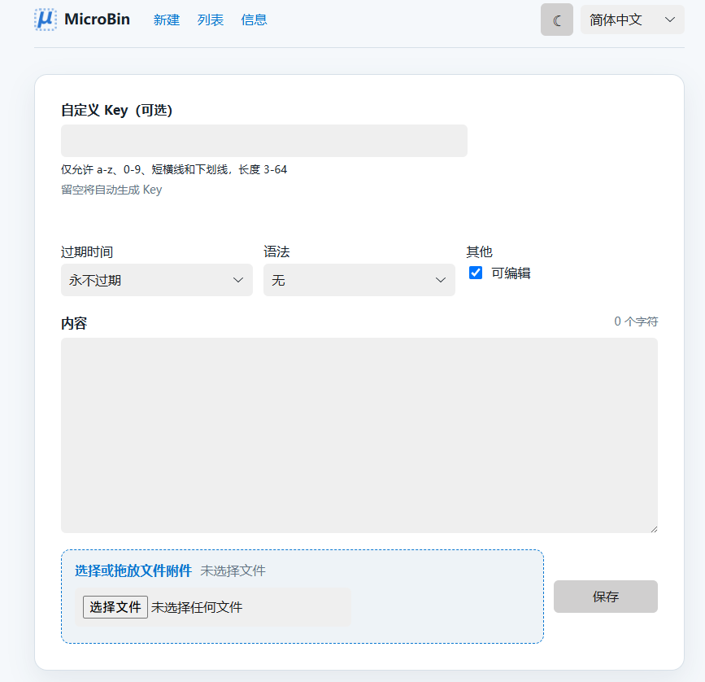

# MicroBin

[English](README_EN.md) | **简体中文**

MicroBin 是一个轻量、可配置、单文件部署的自托管 Pastebin 与短链接服务。它可以保存文本、分享文件、创建 URL 重定向，并提供过期时间、阅后即焚、内容编辑、语法高亮和二维码等功能。

> **项目来源**：本项目引用自 **Dániel Szabó** 开发的 [MicroBin v1.2.1](https://github.com/szabodanika/microbin/tree/v1.2.1)，并在其基础上进行维护与功能调整。原项目版权归 Dániel Szabó 及其贡献者所有。

## 主要功能

- 文本粘贴、文件上传和 URL 缩短/重定向
- 自动生成易读的动物名称标识
- 支持自定义 Key：使用 `a-z`、`0-9`、`-` 和 `_`，长度为 3–64 个字符
- 通过 `/raw/{key}` 获取原始文本，通过 `/file/{key}/{filename}` 下载文件
- 可编辑、只读、私有、公开和阅后即焚内容
- 自定义过期时间和过期数据清理
- 语法高亮与二维码
- `/pastalist` 内容列表及手动删除
- HTTP Basic Auth、只读模式和列表隐藏
- 自动深色模式、自定义 CSS、纯 HTML 模式
- 简体中文与英文界面；首次访问时跟随浏览器语言，并使用 `microbin_lang` Cookie 保存选择
- 使用 JSON 和本地文件存储，便于备份与迁移

## 快速开始

### 从源码运行

需要 Rust 工具链。克隆或下载本仓库后执行：

```bash
cargo run --release -- --editable --highlightsyntax
```

服务默认监听 `0.0.0.0:8080`，然后访问 <http://localhost:8080>。

开发时可以使用：

```bash
cargo run -- --editable --highlightsyntax
```

### 使用 Docker

```bash
docker build -t ghcr.io/vanmaxon/mm:latest .
docker run -d \
  --name microbin \
  -p 8080:8080 \
  -v microbin-data:/app/pasta_data \
  ghcr.io/vanmaxon/mm:latest --editable --highlightsyntax
```

当前 CI 构建的镜像名称为 `ghcr.io/vanmaxon/mm`。默认分支使用 `latest` 标签，同时按台北日期发布 `YYYYMMDD` 格式的版本标签，例如 `20260901`。如需直接使用已发布镜像，可先运行 `docker pull ghcr.io/vanmaxon/mm:latest`。数据保存在 Docker 卷 `microbin-data` 中，访问 <http://localhost:8080> 即可使用。

## 配置

所有命令行选项都可以使用对应的 `MICROBIN_*` 环境变量设置。完整列表请运行：

```bash
cargo run -- --help
```

常用配置如下：

| 命令行参数 | 环境变量 | 默认值 | 说明 |
| --- | --- | --- | --- |
| `--port` | `MICROBIN_PORT` | `8080` | HTTP 监听端口 |
| `--bind` | `MICROBIN_BIND` | `0.0.0.0` | 监听地址 |
| `--public-path` | `MICROBIN_PUBLIC_PATH` | 空 | 对外访问的基础 URL，反向代理部署时建议设置 |
| `--threads` | `MICROBIN_THREADS` | `1` | Web 工作线程数 |
| `--editable` | `MICROBIN_EDITABLE` | 关闭 | 允许创建可编辑内容 |
| `--highlightsyntax` | `MICROBIN_HIGHLIGHTSYNTAX` | 关闭 | 启用语法高亮 |
| `--qr` | `MICROBIN_QR` | 关闭 | 启用二维码 |
| `--private` | `MICROBIN_PRIVATE` | 关闭 | 默认创建私有内容 |
| `--readonly` | `MICROBIN_READONLY` | 关闭 | 禁止通过网页创建新内容 |
| `--no-listing` | `MICROBIN_NO_LISTING` | 关闭 | 隐藏内容列表页 |
| `--auth-username` | `MICROBIN_AUTH_USERNAME` | 空 | Basic Auth 用户名 |
| `--auth-password` | `MICROBIN_AUTH_PASSWORD` | 空 | Basic Auth 密码 |
| `--gc-days` | `MICROBIN_GC_DAYS` | `90` | 内容最后访问多少天后进行清理；设为 `0` 可禁用此项清理 |
| `--custom-css` | `MICROBIN_CUSTOM_CSS` | 空 | 自定义 CSS 地址 |

环境变量示例：

```bash
MICROBIN_PORT=8081 \
MICROBIN_PUBLIC_PATH=https://paste.example.com \
MICROBIN_EDITABLE=true \
MICROBIN_HIGHLIGHTSYNTAX=true \
cargo run --release
```

> 在 PowerShell 中可先使用 `$env:MICROBIN_PORT = "8081"` 设置环境变量，再运行程序。

## 数据与备份

运行数据位于 `pasta_data/`：

- `pasta_data/database.json` 保存内容元数据；
- `pasta_data/public/` 保存上传的文件。

备份时请同时复制整个 `pasta_data/` 目录。升级或重新部署前也建议先完成备份。该目录包含用户数据，不应提交到 Git。

## 开发与检查

```bash
cargo build
cargo test
cargo fmt --all -- --check
cargo clippy --all-targets --all-features -- -D warnings
```

## 安全提示

- 对公网开放时，建议配置 HTTPS 反向代理，并正确设置 `MICROBIN_PUBLIC_PATH`。
- 如内容不应公开浏览，请启用 Basic Auth 或设置 `MICROBIN_NO_LISTING=true`。
- 上传内容会写入本地磁盘，请监控磁盘空间并定期备份。
- 安全问题请按照 [SECURITY.md](SECURITY.md) 中的方式报告。

## 许可证与致谢

本项目引用自 Dániel Szabó 的 MicroBin v1.2.1，遵循 [BSD 3-Clause License](LICENSE)。

Copyright © 2022 Dániel Szabó. All rights reserved.
